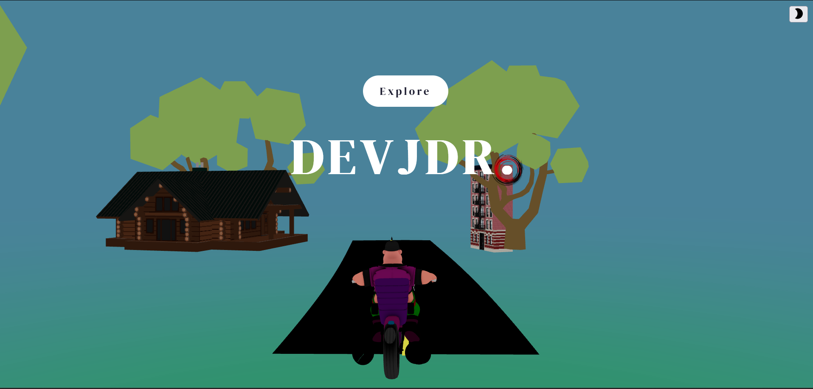

# 3D Portfolio Website

This project showcases a 3D Portfolio Website developed with React Three Fiber, offering users an immersive and visually captivating experience. The website aims to evoke a serene ambiance through its minimalistic and aesthetically pleasing interface, providing a unique and engaging way to explore the content.

## Features

This React Three Fiber 3D Portfolio features a dynamic environment, responsive design, scroll-driven animations, interactive bike animation, audio integration, and a calming minimalistic interface.

